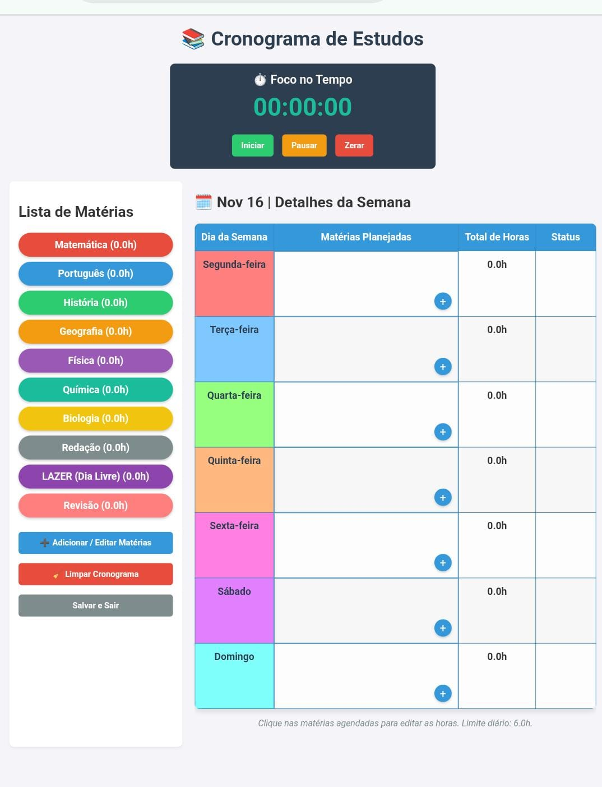

# 📚 Cronograma de Estudos Interativo (Study Scheduler)

**Study Scheduler interativo (Drag & Drop) para organização semanal de estudos. Inclui monitoramento de limite de horas (6h por dia) e cronômetro de foco, desenvolvido com Vanilla JS.**

Este é um projeto simples e interativo para auxiliar estudantes a organizarem sua rotina diária de estudos para concursos, simulando um programa de planejamento focado no controle de horas e no monitoramento de desempenho.

---

## 📸 Visão Geral do Projeto

Para que você possa visualizar o layout e as funcionalidades, confira a imagem de prévia:

 
 
---

## 🚀 Acesse o Projeto

Você pode acessar e interagir com a aplicação **diretamente**, sem precisar baixar o código:

**[Acessar Cronograma de Estudos](https://rodrigomenezesdev.github.io/cronograma-estudo/)**

---

## ✨ Funcionalidades Principais

O projeto foi desenvolvido para oferecer uma experiência intuitiva e focada na produtividade:

* **Drag and Drop (Arrastar e Soltar):** Arraste matérias da lista de referência para o dia da semana desejado na tabela do cronograma.
* **Controle de Limite Diário (2h a 6h):** O sistema monitora automaticamente o total de horas por dia, exibindo um **Status** visual (`OK`, `POUCO` ou `EXCEDEU`) e bloqueando a adição de novas matérias se o limite de **6.0 horas** for ultrapassado.
* **Edição de Horas:** Clique na matéria dentro da tabela para editar rapidamente o tempo de estudo dedicado a ela.
* **Cronômetro Decrescente de 6h:** Um cronômetro no topo da página ajuda a manter o foco, permitindo iniciar (▶️), pausar (⏸️) e resetar (🔄) o tempo total de estudo do dia.
* **Botão Sair Seguro:** Inclui uma confirmação (`confirm()`) ao tentar sair, protegendo contra o fechamento acidental da página.

---

## 🛠️ Tecnologias Utilizadas

Este é um projeto puramente **Front-end** construído com:

* **HTML5:** Estrutura semântica da página, tabela e componentes.
* **CSS3:** Estilização, layout responsivo básico e definição das cores por matéria/dia.
* **JavaScript (Vanilla JS):** Lógica interativa do *Drag and Drop*, cálculos de horas, controle do cronômetro, validação de limites e manipulação do DOM.

---

## ⚙️ Como Usar (Guia Rápido)

1.  **Arraste:** Escolha uma matéria na lista à esquerda e arraste-a para o dia correspondente na coluna "Matérias Planejadas".
2.  **Monitore:** Observe a coluna "Status" para garantir que você esteja dentro da meta de **2h a 6h** diárias.
3.  **Ajuste:** Clique no nome da matéria dentro da tabela para ajustar o tempo de estudo.
4.  **Cronometre:** Use os botões **Iniciar/Pausar** no cronômetro para medir o seu tempo de foco diário.

---

## 🤝 Contribuição

Sinta-se à vontade para sugerir melhorias, reportar bugs ou enviar Pull Requests.

1.  Faça um Fork do projeto.
2.  Crie uma nova branch (`git checkout -b feature/minha-feature`).
3.  Faça o commit das suas alterações (`git commit -m 'feat: Adiciona nova funcionalidade X'`).
4.  Faça o push para a branch (`git push origin feature/minha-feature`).
5.  Abra um Pull Request.

---

Feito com ❤️ por [RodrigoMenezesdev]
